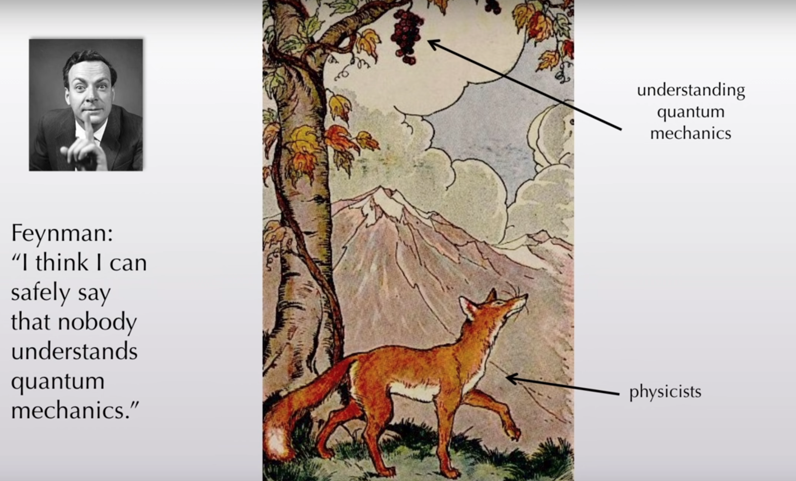
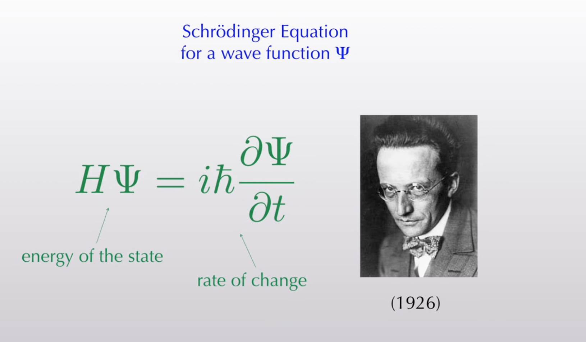
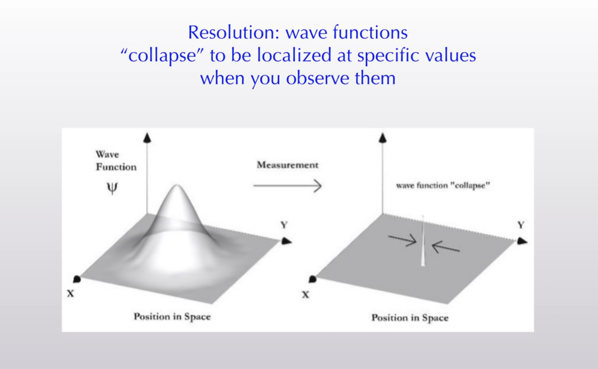
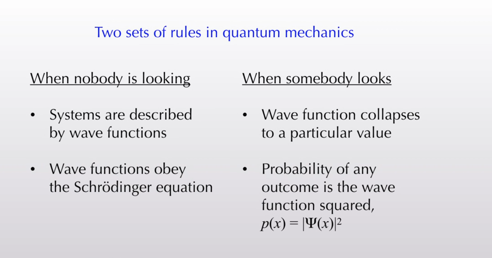

#  Quantum Mechanics
-  The fundamental theory in physics that provides a description of the physical properties of nature at the scale of **atoms and subatomic particles**.
- **Classical physics**, the description of physics that existed before the theory of relativity and quantum mechanics, describes many aspects of nature at an ordinary (**macroscopic**) scale, while quantum mechanics explains the aspects of nature at small (atomic and subatomic) scales, for which classical mechanics is insufficient.

- Think:
    - Electrons are waves concentrated near atomic nuclear, instead  the electron is a little point moving in an orbit 
    - Orbits are different shapes the electron waves can take

## Resources
- [A Brief History of Quantum Mechanics - with Sean Carroll](https://www.youtube.com/watch?v=5hVmeOCJjOU)
- [Quantum mechanics](https://en.wikipedia.org/wiki/Quantum_mechanics)
